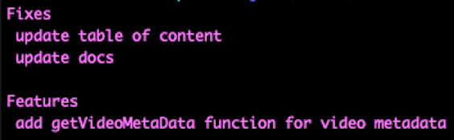

### Would you like to support me?

<div align="center">
<a href="https://github.com/nomi9995?tab=followers">
    
</a>
</br>
<a href="https://www.buymeacoffee.com/numan.dev" target="_blank"></a>
</div>

## Release Notes

Generate release notes from git commit history either **commit range** or **tag range**.



### Installation

It's preferable to install it globally through [`npm`](https://www.npmjs.com/package/release-notes-cli)

    npm install -g release-notes-cli

It's also possible to use `release-notes-cli` as a node module. Check the usage on [usage as a module](#Usage_as_a_module)

### Usage

you can call this cli by **release-notes-cli** / **release-notes** / **rn**
The basic usage from the command line is

```
release-notes <since>..<until> <template> --copy

# like this
release-notes v1.4.0..v1.5.2 appstore --copy
```

Where

- `<since>..<until>` specifies the range of commits as in `git log`, see [gitrevisions(7)](http://www.kernel.org/pub/software/scm/git/docs/gitrevisions.html)
- `<template>` is an [ejs](https://github.com/visionmedia/ejs) template file used to generate the release notes
- `--copy` will copy the log into clipboard

Three sample templates are included as a reference in the `templates` folder

- `appstore` [(sample)](https://github.com/nomi9995/release-notes-cli/blob/master/samples/output-appstore.txt)
- `markdown` [(sample)](https://github.com/nomi9995/release-notes-cli/blob/master/samples/output-markdown.md)
- `html` [(sample)](http://htmlpreview.github.io/?https://github.com/nomi9995/release-notes-cli/blob/master/samples/output-html.html)
- `html-bootstrap` [(sample)](http://htmlpreview.github.io/?https://github.com/nomi9995/release-notes-cli/blob/master/samples/output-html-bootstrap.html)

This for example is the release notes generated for `joyent/node` by running

    release-notes-cli v0.9.8..v0.9.9 html > changelog.html

[](https://github.com/nomi9995/release-notes-cli/raw/master/samples/node.png)

#### App Store Template

**Note:** for appstore release notes, commits title should be have [Commitlint header](https://github.com/conventional-changelog/commitlint#what-is-commitlint) format like

```
chore: run tests on travis ci
```

```
fix(server): send cors headers
```

```
feat(blog): add comment section
```

#### Custom template

The second parameter of `release-notes-cli` can be any path to a valid ejs template files.

##### Template Variables

Several template variables are made available to the script running inside the template.

`commits` is an array of commits, each containing

- `sha1` commit hash (%H)
- `authorName` author name (%an)
- `authorEmail` author email (%ae)
- `authorDate` author date (%aD)
- `committerName` committer name (%cn)
- `committerEmail` committer email (%ce)
- `committerDate` committer date (%cD)
- `title` subject (%s)
- `tag` tag (%D)
- `messageLines` array of body lines (%b)

`dateFnsFormat` is the date-fns [format](https://date-fns.org/docs/format) function. See the [html-bootstrap](https://github.com/nomi9995/release-notes-cli/blob/master/templates/html-bootstrap.ejs) for sample usage.

`range` is the commits range as passed to the command line

### Options

More advanced options are

- `p` or `path` Git project path, defaults to the current working path
- `b` or `branch` Git branch, defaults to `master`
- `t` or `title` Regular expression to parse the commit title (see next chapter)
- `i` or `ignore-case` Ignore case flag for title's regular expression. `/.*/` becomes `/.*/i`
- `m` or `meaning` Meaning of capturing block in title's regular expression
- `f` or `file` JSON Configuration file, better option when you don't want to pass all parameters to the command line, for an example see [options.json](https://github.com/nomi9995/release-notes-cli/blob/master/options.json)
- `s` or `script` External script for post-processing commits
- `mg` or `merge-commits` List only merge commits, `git log` command is executed with the `--merges` flag instead of `--no-merges`
- `c` or `copy` uses for copy the log
- `o` or `gitlog-option` to add some additional git log options **and** ignores the `merge-commits` option, this is direct given to `git log` by adding a `--` to each longname option from the array (e.g. `-o first-parent`).

#### Title Parsing

Some projects might have special naming conventions for the commit title.

The options `t` and `m` allow to specify this logic and extract additional information from the title.

For instance, [Aria Templates](https://github.com/nomi9995/nomi9995) has the following convention

    fix #123 Title of a bug fix commit
    feat #234 Title of a cool new feature

In this case using

```
release-notes-cli -t "^([a-z]+) #(\d+) (.*)$" -m type -m issue -m title v1.3.6..HEAD html
```

generates the additional fields on the commit object

- `type` first capturing block
- `issue` second capturing block
- `title` third capturing block (redefines the title)

Another project using similar conventions is [AngularJs](https://github.com/angular/angular.js), [commit message conventions](https://docs.google.com/document/d/1QrDFcIiPjSLDn3EL15IJygNPiHORgU1_OOAqWjiDU5Y/edit#).

```
release-notes-cli -t "^(\w*)(?:\(([\w\$\.]*)\))?\: (.*)$" -m type -m scope -m title v1.1.2..v1.1.3 markdown
```

#### Post Processing

The advanced options cover the most basic use cases, however sometimes you might need some additional processing, for instance to get commit metadata from external sources (Jira, GitHub, Waffle...)

Using `-s script_file.js` you can invoke any arbitrary node script with the following signature:

```js
module.exports = function (data, callback) {
  /**
   * Here `data` contains exactly the same values your template will normally receive. e.g.
   *
   * {
   *   commits: [], // the array of commits as described above
   *   range: '<since>..<until>',
   *   dateFnsFormat: function () {},
   *   debug: function() {}, // utility function to log debug messages
   * }
   *
   * Do all the processing you need and when ready call the callback passing the new data structure
   */
  callback({
    commits: data.commits.map(doSomething),
    extra: { additional: "data" },
  });
  //
};
```

The object passed to the callback will be merged with the input data and passed back to the template.

For an example check `samples/post-processing.js`

### Usage as a module

#### Installation

npm install --save-dev release-notes-cli

#### Usage

Inside your script file

```js
const releaseNotes = require("release-notes-cli");

const OPTIONS = {
  branch: "master",
};
const RANGE = "v1.0.0..v2.0.0";
const TEMPLATE = "markdown";

releaseNotes(OPTIONS, RANGE, TEMPLATE)
  .then(changelog => {
    console.log(`Changelog between ${RANGE}\n\n${changelog}`);
  })
  .catch(ex => {
    console.error(ex);
    process.exit(1);
  });
```

#### Options

The syntax reflects the command line parameters, so options is an object containing `path`, `branch`, `title` and so on. You can refer to the list of options in the command line usage section. You can use either the long or short syntax, the module will use the same defaults as the command line if an option is missing.

However, there is a little difference between module usage and CLI of the `script` parameter. When used as CLI, it receives a path link to a JS module file, but used as a module, it receives a function:

```js
releaseNotes(
  {
    branch: "master",
    script: (data, callback) => {
      callback({
        foo: "bar",
      });
    },
  },
  RANGE,
  TEMPLATE
);
```

### Typescript

`release-notes-cli` includes [Typescript](http://www.typescriptlang.org/) definitions.

```ts
import * as releaseNotes from "release-notes-cli";
releaseNotes({ path }, range, TEMPLATE);
```

### Debug

If your post processing script or template throws an exception, the JSON data will be written to the file system in the same folder as the processing script.

The DEBUG environment variable can also be useful for fault diagnosis:

#### Linux

    export DEBUG=release-notes:*
    release-notes-cli ...

#### Windows

    SET DEBUG=release-notes:cli,release-notes:externalscript
    release-notes-cli ...
